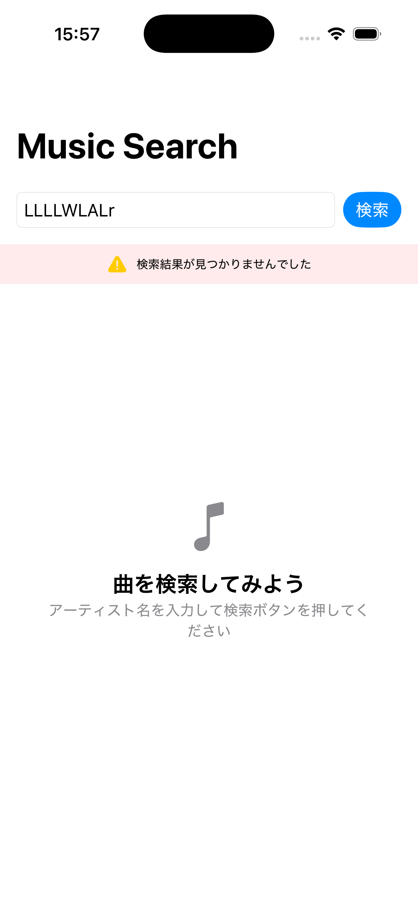
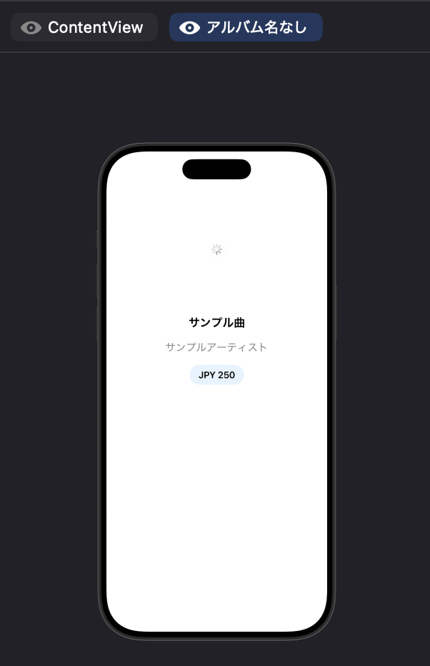
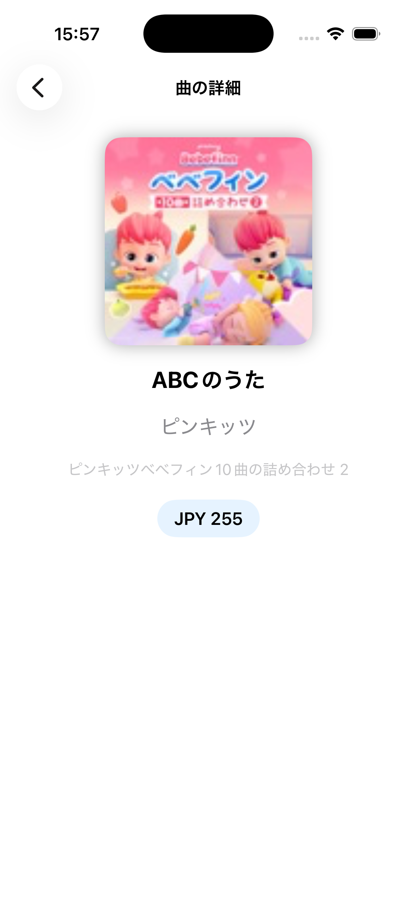
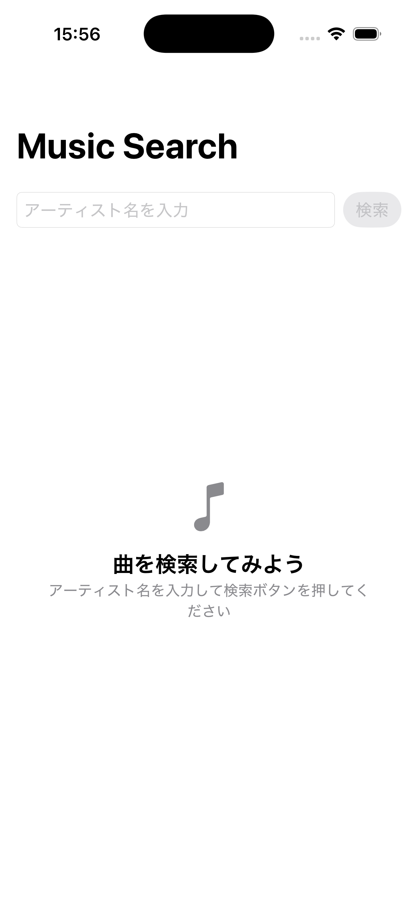

# WebAPI通信で学んだ  
# `guard let` と `if let` の使い分け

**発表者：卞 宜璇**

---

## 1．このテーマを選んだ理由

第1章「WebAPIの基本」について発表します。

私は、この章を選びました。

理由は、就職活動の面接で、自分が作ったアプリについて説明したとき、企業の方からAPIについて質問を受けたからです。

そのとき、私はAPIを使っていましたが、

> なぜこの書き方をするのか

ということまでは、うまく説明できませんでした。

そのため、今回はAPIの仕組みだけではなく、**Swiftらしい安全な書き方**について勉強しました。

---

## 2．このアプリは何をするのか

このアプリは、iTunes APIを使って音楽を検索するアプリです。

<p align="center">
  
</p>

処理の流れは、次のようになります。

```text
検索文字を入力
        ↓
URLを生成する
        ↓
APIへ通信する
        ↓
JSONを受け取る
        ↓
Swiftのデータ型へ変換する
        ↓
画面に表示する
```

私は最初、**API通信が一番難しい**と思っていました。

しかし、勉強して分かったことは、通信することだけではなく、**データを安全に扱うことが大切**だということでした。

---

## 3．`guard let`

### コード

```swift
guard let url = URL(string: urlString) else {
    return
}
```

### 何をしているか

URLを安全に生成しています。

URLを生成できなければ、その後のAPI通信を行わず、処理を終了します。

### なぜ `guard let` を使うのか

URLがなければ、API通信はできません。

そのため、最初にURLを確認し、失敗した場合はすぐに処理を終了します。

### 私が理解したこと

私は `guard let` を、**入口の門番**だと考えています。

必要なデータがなければ、先へ進めないようにするからです。

---

## 4．`if let`

### コード

```swift
if let albumName = song.collectionName {
    Text(albumName)
}
```

### 何をしているか

アルバム名が存在するときだけ、画面に表示しています。

<p align="center">
  
</p>

### なぜ `if let` を使うのか

アルバム名がなくても、曲名やアーティスト名は表示できます。

そのため、アプリの処理をすべて止める必要はありません。

### 私が理解したこと

私は `if let` を、**VIPルーム**だと考えています。

条件を満たしたデータだけが、その波括弧の中に入り、使用できるからです。

---

## 5．`guard let` と `if let` の違い

| `guard let` | `if let` |
|---|---|
| 値がなければ処理を止める | 値があれば使用する |
| `return` して終了する | その後も処理を続ける |
| 前提条件を確認する | 必要な部分だけで使用する |
| 宣言後も同じスコープ内で使える | 基本的に波括弧の中だけで使える |

私は、この違いが一番大切だと思いました。

コードを書く前に、

> 処理を止めるべきか、続けるべきか

を考えるようになりました。

---

## 6．AIに質問して理解したこと

私はAIに、次のように質問しました。

> `guard let` と `if let` の違いは何ですか。

最初は、どちらも `nil` をチェックする文法なので、同じようなものだと思っていました。

しかし、AIの説明を聞いて、**使う場面が違う**ことが分かりました。

`guard let` で取り出した変数は、その後の同じスコープ内でも使用できます。

一方、`if let` で取り出した変数は、基本的に波括弧の中だけで使用できます。

この違いを理解できたことが、今回一番勉強になったことです。

---

## 7．自分で試したこと

私は、二つの実験をしました。

### 一つ目：検索結果がない場合

`guard let` を使って、URLを安全に生成できるか確認しました。

URLを生成できない場合は、API通信が始まりません。

また、実際に「LLLLWLALr」のような意味のない文字列で検索しました。

この場合、URLは正常に生成されましたが、APIから該当する曲が返されませんでした。

そのため、画面には次のエラーメッセージが表示されました。

> 検索結果が見つかりませんでした

<p align="center">
  
</p>

アプリはクラッシュせず、正常にエラーメッセージを表示できました。

### 二つ目：アルバム名がない場合

`if let` を使って、アルバム名が存在するときだけ表示しました。

アルバム名のデータがない場合でも、曲名やアーティスト名は表示され、アプリは正常に動きました。

<p align="center">
  
</p>

この実験によって、`guard let` と `if let` は、使う目的が違うことを確認できました。

---

## 8．まとめ

今回の学習で、WebAPIでは、データを取得するだけではなく、**データを安全に扱うこと**がとても大切だと学びました。

また、コードを書くときは、

> どう書くか

だけではなく、

> なぜこの書き方を選ぶのか

を考えることも大切だと思いました。

今回の発表を通して、`guard let` と `if let` は、どちらが良いかではなく、**どのような場面で使うかを考えることが大切**だと分かりました。

今後は、自分のアプリでもWebAPIを活用し、安全で読みやすいコードを書けるようになりたいです。

以上で発表を終わります。

ありがとうございました。
